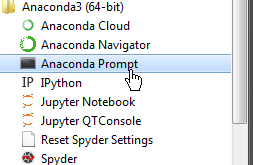

# Installasjon av Jypyter notebook med Anaconda

## Installer anaconda
- Last ned og installer siste [Anaconda versjon](https://www.anaconda.com/download) for python 3.6 eller høyere. 
- Start **anaconda prompt** : Start -> Alle programmer -> Anaconda 3 -> Anaconda prompt. 



Dette er en windows kommandolinje med litt utvidede funksjoner. Du bruker **anaconda prompt** til å kjøre kommandoene for å installere de bibliotekene som trengs.  


## Last ned eksempelkode
- Last ned koden fra https://github.com/atlefren/gd18_python_demo
    - ```git clone https://github.com/atlefren/gd18_python_demo.git```
    - Eller du kan laste ned denne [zip-fila](https://github.com/atlefren/gd18_python_demo/archive/master.zip) og pakke ut et passende sted. 

## Lag et Anaconda-environment
- I anaconda promt navigerer du deg til gd18_python_demo
- lag et environment: ```conda env create -f environment.yml```

## kjør opp notebooken
- ```jupyter notebook```


## Kjøre kode
Start notebook, naviger til riktig mappe og åpne et av ```.ipynb``` - eksemplene. Velg "Cell -> Run all"

Notebook kan startes på flere måter: 
* Fra anaconda prompt (eller linux shell): ```jupyter notebook```
* Fra anaconda navigator 
* Fra programmenyen (Start -> Alle programmer -> Anaconda3 -> Jupyter notebook)


